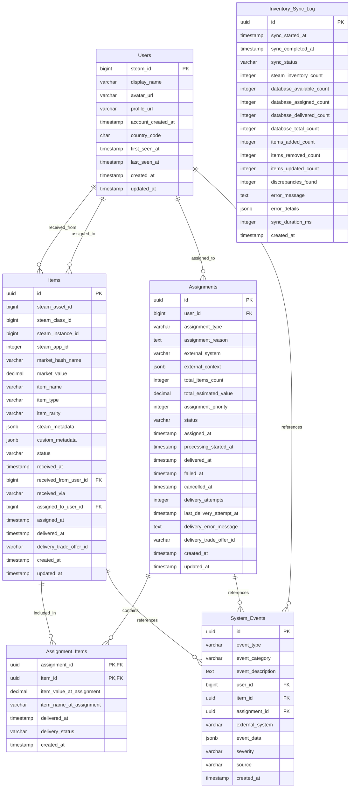

# ADR-002: Database Schema Design

## Status
**Accepted**

## Context
Astro requires a focused database design that supports the core Steam bot functionality while maintaining clear architectural boundaries. The schema must handle:

- Core item management with shared pool approach
- Generic assignment system usable by any external system
- 1:1 synchronization between Steam bot inventory and database
- High-frequency inventory updates and trade operations
- Audit trail for all item movements
- Clean separation between core item management and business logic

The database design must balance simplicity with extensibility, ensuring the core system remains focused while supporting future growth.

## Decision

### Core-Focused Database Approach
We will use a **single PostgreSQL database** containing core Astro functionality:
- **Domain Separation**: Core handles Steam item operations, external systems handle business logic
- **Clear Boundaries**: Database schema reflects core responsibilities only
- **External Integration**: Business logic data stored by systems that own it (SourceMod, Discord bots, etc.)
- **Future Extensibility**: Architecture allows for additional data integration patterns as needs evolve

### Core Database Schema



#### Key Schema Characteristics

- **Users**: Steam profile information and activity tracking
- **Items**: Shared pool with Steam identifiers, status tracking, and flexible metadata
- **Assignments**: Generic system for item-to-user assignments with external system context
- **Assignment_Items**: Many-to-many relationship tracking individual item delivery
- **Inventory_Sync_Log**: 1:1 synchronization monitoring between Steam and database
- **System_Events**: Comprehensive audit trail for all operations

## Rationale

### Why Core-Focused Database Design?
- **Clear Responsibility**: Database reflects core domain (Steam item management)
- **Operational Simplicity**: Single database with focused schema and clear purpose
- **Loose Coupling**: External systems maintain autonomy over their data
- **Performance**: Optimized for high-frequency Steam bot operations
- **Maintainability**: Simplified schema evolution and maintenance

### Why External System Data Separation?
- **Domain Ownership**: Business logic data belongs with systems that understand and use it
- **System Autonomy**: External systems choose their optimal data storage approach
- **Reduced Coupling**: Core system evolution independent of external system requirements
- **Scalability**: Each system can optimize its data layer independently
- **Architectural Clarity**: Clear boundaries between Steam operations and business logic

### Why Generic Assignment System?
- **External System Agnostic**: Works with any system (SourceMod, Discord, web apps)
- **Flexible Context**: JSONB field allows external systems to store relevant data
- **Audit Trail**: Complete tracking without needing to understand business logic
- **Clean API**: External systems just need to create assignments and check status

### Why JSONB for Context?
- **Flexibility**: External systems store whatever context they need
- **Performance**: JSONB provides indexing and query capabilities when needed
- **Future-Proofing**: Can evolve without schema changes
- **System Agnostic**: Each external system can use context differently

## Implementation Considerations

### Entity Framework Configuration
```csharp
public class AstroDbContext : DbContext
{
    // Core entities: Users, Items, Assignments, AssignmentItems, 
    // InventorySyncLog, SystemEvents
    
    protected override void OnModelCreating(ModelBuilder modelBuilder)
    {
        // Unique constraint: Steam assets can only exist once per app
        modelBuilder.Entity<Item>()
            .HasIndex(i => new { i.SteamAssetId, i.SteamAppId })
            .IsUnique();
            
        // Many-to-many: Assignments can contain multiple items
        modelBuilder.Entity<Assignment>()
            .HasMany(a => a.Items)
            .WithMany(i => i.Assignments)
            .UsingEntity<AssignmentItem>();
    }
}
```

### 1:1 Inventory Synchronization Strategy
1. **Periodic Full Sync**: Every 5 minutes, compare Steam inventory with database
2. **Event-Driven Sync**: Immediate sync after trade completion
3. **Discrepancy Resolution**: Automatic reconciliation with manual override capability
4. **Sync Logging**: Complete audit trail of all synchronization operations

### External System Integration Pattern
External systems create assignments through simple API calls:

```json
POST /api/assignments
{
    "userId": 76561198123456789,
    "itemIds": ["item-uuid-1", "item-uuid-2"],
    "assignmentType": "giveaway",
    "externalSystem": "sourcemod_giveaway",
    "externalContext": {
        "giveawayId": "gw_123",
        "serverName": "Community Server #1"
    }
}
```

The core system handles delivery and status tracking, while external systems maintain their own business logic and data.

### Migration Strategy
- **Single Migration Path**: Only core schema migrations
- **No Plugin Dependencies**: External systems manage their own data migration
- **Backward Compatibility**: Core schema changes won't break external systems
- **Rollback Simplicity**: Only one database to rollback

### Performance Considerations
- **Focused Indexing**: Indexes only on core item management queries
- **Simplified Queries**: No complex cross-plugin joins
- **Reduced Load**: Database handles only Steam bot operations
- **Connection Efficiency**: Single database connection pool

### Security Considerations
- **Simple Permissions**: Single database with straightforward access patterns
- **External Data Isolation**: Business logic data stored securely by owning systems
- **Audit Trail**: Complete tracking of core operations
- **API Security**: Authentication handled at HTTP API level

## Future Possibilities

### Enhanced Data Integration (Future Consideration)
As the system evolves and requirements become clearer, additional data integration patterns could be considered:
- **Centralized Reporting**: Cross-system analytics and reporting capabilities
- **Data Warehousing**: Historical data aggregation from multiple systems
- **Plugin Data Services**: Optional centralized storage for systems that would benefit
- **Advanced Analytics**: Machine learning and pattern recognition across system boundaries

These enhancements would be evaluated based on:
- **Demonstrated Need**: Clear community and operational requirements
- **Architectural Fit**: Alignment with core system principles
- **Implementation Cost**: Development and operational overhead
- **Backward Compatibility**: Non-disruptive evolution of existing integrations

## Success Metrics
- **Database Simplicity**: Single schema focused on core functionality
- **Sync Accuracy**: 100% synchronization between Steam inventory and database
- **Query Performance**: < 100ms for core item management queries
- **Data Consistency**: Zero data corruption or orphaned records
- **System Independence**: External systems operate independently of Astro database

## Review Date
This ADR should be reviewed after implementing the first two plugins (Giveaway and VIP) to validate the simplified approach and assess whether plugin database integration provides demonstrable value.